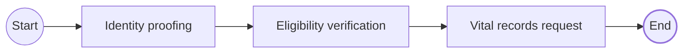
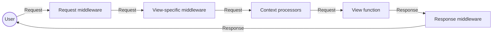
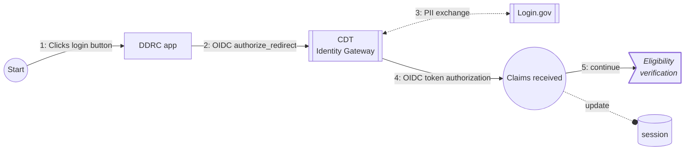
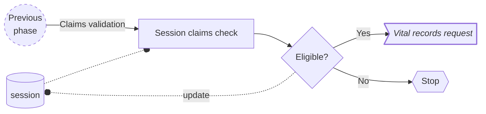
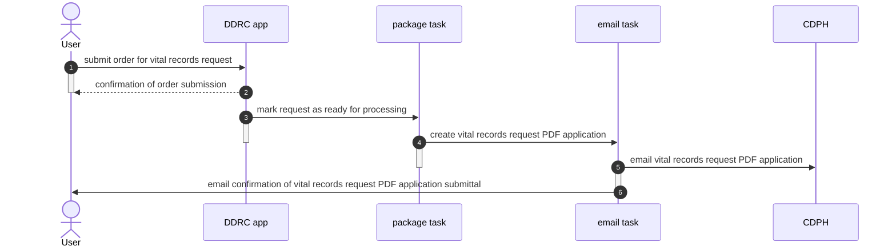

# Application logic

This page describes how DDRC defines user flows through the following high-level _phases_:

1. [Identity proofing](#identity-proofing)
1. [Eligibility verification](#eligibility-verification)
1. [Vital records request](#vital-records-request)

The structure of the source code in [`cdt-ods-disaster-recovery/`](https://github.com/Office-of-Digital-Services/cdt-ods-disaster-recovery/)
generally follows from these phases:

- [`web/core/`](https://github.com/Office-of-Digital-Services/cdt-ods-disaster-recovery/tree/main/web/core) implements shared logic, models, and hooks for [`django-cdt-identity/`](https://github.com/Office-of-Digital-Services/django-cdt-identity/)
- [`web/vital_records/`](https://github.com/Office-of-Digital-Services/cdt-ods-disaster-recovery/tree/main/web/vital_records) implements a request for
  vital records
- [`web/vital_records/tasks/`](https://github.com/Office-of-Digital-Services/cdt-ods-disaster-recovery/tree/main/web/vital_records/tasks) implements async tasks run by a task queue

`core` and `vital_records` are standalone Django apps registered in Django's settings.

Furthermore, the source code in [`django-cdt-identity/`](https://github.com/Office-of-Digital-Services/django-cdt-identity/) implements identity proofing in:

- [`cdt_identity/`](https://github.com/Office-of-Digital-Services/django-cdt-identity/tree/main/cdt_identity) implements identity proofing and
  claims verification with the California Department of Technology's Identity Gateway

## Django request pipeline

Each request to the DDRC app is ultimately a [Django request](https://docs.djangoproject.com/en/5.0/ref/request-response/)
and goes through the [Django HTTP request pipeline](https://docs.djangoproject.com/en/5.0/topics/http/).

DDRC uses middleware to pre- and post-process requests for (view) access control, and session configuration.

!!! example "Key supporting files"

    [`web/core/middleware.py`][core-middleware]

In general, the flow of a Django request looks like:

## Identity proofing

In this phase, DDRC takes the user through an [OpenID Connect (OIDC)](https://openid.net/developers/how-connect-works/)
flow as a Client (the Relying Party or RP) of the CDT Identity Gateway (the Identity Provider or IDP), via Login.gov.

The CDT Identity Gateway transforms PII from Login.gov into anonymized boolean claims that are later used in
[eligibility verification](#eligibility-verification).

!!! example "Entrypoint"

    [`cdt-ods-disaster-recovery/web/vital_records/views/common.py`][oauth-eligibility-views]

!!! example "Key supporting files"

    [`django-cdt-identity/cdt_identity/client.py`][oauth-client]

    [`django-cdt-identity/cdt_identity/hooks.py`][oauth-hooks]

## Eligibility verification

In this phase, DDRC verifies the user's claims by using claims previously stored in the user's session during [Identity proofing](#identity-proofing)

!!! example "Entrypoint"

    [`cdt-ods-disaster-recovery/web/vital_records/views/common.py`][oauth-eligibility-views]

!!! example "Key supporting files"

    [`django-cdt-identity/cdt_identity/views.py`][eligibility-verify]

## Vital records request

In this final phase, the user fills out a series of forms to submit an order for a vital records request and the DDRC application generates a PDF of the vital records request and emails it to the California Department of Public Health (CDPH).

### Order records

#### Birth

The user fills out the following forms:

- Name on birth certificate
- County of birth
- Date of birth
- Name of parents
- Order information

!!! example "Entrypoint"

    [`cdt-ods-disaster-recovery/web/vital_records/views/common.py`][order-record-views]

!!! example "Supporting views"

    [`cdt-ods-disaster-recovery/web/vital_records/views/birth.py`](https://github.com/Office-of-Digital-Services/cdt-ods-disaster-recovery/blob/main/web/vital_records/views/birth.py)

#### Marriage

The user fills out the following forms:

- Name of persons on marriage record
- County of marriage
- Date of marriage
- Order information

!!! example "Entrypoint"

    [`cdt-ods-disaster-recovery/web/vital_records/views/common.py`][order-record-views]

!!! example "Supporting views"

    [`cdt-ods-disaster-recovery/web/vital_records/views/marriage.py`](https://github.com/Office-of-Digital-Services/cdt-ods-disaster-recovery/blob/main/web/vital_records/views/marriage.py)

### Submit records

The DDRC application generates a PDF of the vital records request and emails it to CDPH.

!!! example "Async tasks"

    [`cdt-ods-disaster-recovery/web/vital_records/tasks/package.py`](https://github.com/Office-of-Digital-Services/cdt-ods-disaster-recovery/blob/main/web/vital_records/tasks/package.py)
    [`cdt-ods-disaster-recovery/web/vital_records/tasks/email.py`](https://github.com/Office-of-Digital-Services/cdt-ods-disaster-recovery/blob/main/web/vital_records/tasks/email.py)

[core-middleware]: https://github.com/Office-of-Digital-Services/cdt-ods-disaster-recovery/blob/main/web/core/middleware.py <!-- markdownlint-disable-line MD034 -->
[eligibility-verify]: https://github.com/Office-of-Digital-Services/django-cdt-identity/blob/main/cdt_identity/views.py <!-- markdownlint-disable-line MD034 -->
[order-record-views]: https://github.com/Office-of-Digital-Services/cdt-ods-disaster-recovery/blob/main/web/vital_records/views/common.py <!-- markdownlint-disable-line MD034 -->
[oauth-client]: https://github.com/Office-of-Digital-Services/django-cdt-identity/blob/main/cdt_identity/client.py <!-- markdownlint-disable-line MD034 -->
[oauth-hooks]: https://github.com/Office-of-Digital-Services/django-cdt-identity/blob/main/cdt_identity/hooks.py <!-- markdownlint-disable-line MD034 -->
[oauth-eligibility-views]: https://github.com/Office-of-Digital-Services/cdt-ods-disaster-recovery/blob/main/web/vital_records/views/common.py <!-- markdownlint-disable-line MD034 -->
