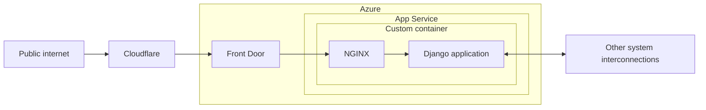
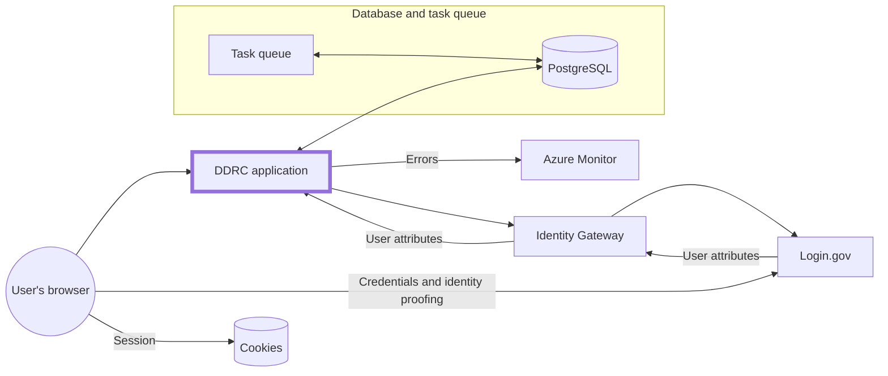

# Infrastructure

The infrastructure is configured as code via [Terraform](https://www.terraform.io/), for [various reasons](https://techcommunity.microsoft.com/t5/fasttrack-for-azure/the-benefits-of-infrastructure-as-code/ba-p/2069350), and is deployed into a Microsoft Azure account provided by the California Department of Technology (CDT)'s Office of Enterprise Technology (OET) team.

The Azure portal is where you can view the infrastructure resources for DDRC. Azure DevOps is where our [infrastructure pipeline](https://github.com/Office-of-Digital-Services/cdt-ods-disaster-recovery/blob/main/terraform/azure-pipelines.yml) is run to build and deploy those infrastructure resources.

## Environments

Within the `CDT Digital CA` directory, there are two [Subscriptions](https://learn.microsoft.com/en-us/microsoft-365/enterprise/subscriptions-licenses-accounts-and-tenants-for-microsoft-cloud-offerings?view=o365-worldwide#subscriptions), with [Resource Groups](https://learn.microsoft.com/en-us/azure/azure-resource-manager/management/manage-resource-groups-portal#what-is-a-resource-group) under each. However, only one subscription is currently being used
for DDRC.

Each of our environments corresponds to a single Resource Group and [Terraform Workspace](https://developer.hashicorp.com/terraform/language/state/workspaces).

| Environment | Subscription         | Resource Group              | Workspace |
| ----------- | -------------------- | --------------------------- | --------- |
| Dev         | `CDT/ODI Production` | `RG-CDT-PUB-VIP-DDRC-D-001` | `dev`     |
| Test        | `CDT/ODI Production` | `RG-CDT-PUB-VIP-DDRC-T-001` | `test`    |
| Prod        | `CDT/ODI Production` | `RG-CDT-PUB-VIP-DDRC-P-001` | `default` |

All resources in these Resource Groups should be reflected in Terraform in this repository. The exceptions are:

- Secrets, such as values under [Key Vault](https://azure.microsoft.com/en-us/services/key-vault/). [`prevent_destroy`](https://developer.hashicorp.com/terraform/tutorials/state/resource-lifecycle#prevent-resource-deletion) is used on these Resources.
- [Things managed by DevSecOps](#ownership)

### Ownership

The following things in Azure are managed by CDT's OET DevSecOps team:

- Subcriptions
- Resource Groups
- Networking
- Front Door
  - Web Application Firewall (WAF) <!-- markdownlint-disable-line MD007 -->
  - Distributed denial-of-service (DDoS) protection <!-- markdownlint-disable-line MD007 -->
- IAM
- Service connections

You'll see these referenced in Terraform as [data sources](https://developer.hashicorp.com/terraform/language/data-sources), meaning they are managed outside of Terraform.

## Architecture

These diagrams show a high-level view of the architecture per environment, including some external systems such as error monitoring.

### DDRC application



[Front Door](https://docs.microsoft.com/en-us/azure/frontdoor/front-door-overview) also includes the [Web Application Firewall (WAF)](https://docs.microsoft.com/en-us/azure/web-application-firewall/afds/afds-overview) and handles TLS termination. Front Door is managed by the DevSecOps team.

### System interconnections



## Naming conventions

The DevSecOps team sets the following naming convention for Resources:

```<!-- markdownlint-disable-line MD040 -->
<<Resource Type>>-<<Department>>-<<Public/Private>>-<<Project Category>>-<<Project Name>>-<<Region>><<OS Type>>-<<Environment>>-<<Sequence Number>>
```

### Sample Names

- `RG-CDT-PUB-VIP-BNSCN-E-D-001`
- `ASP-CDT-PUB-VIP-BNSCN-EL-P-001`
- `AS-CDT-PUB-VIP-BNSCN-EL-D-001`

### Resource Types

Use the following shorthand for conveying the Resource Type as part of the Resource Name:

| Resource         | Convention |
| ---------------- | ---------- |
| App Service      | `AS`       |
| App Service Plan | `ASP`      |
| Virtual Network  | `VNET`     |
| Resource Group   | `RG`       |
| Virtual Machine  | `VM`       |
| Database         | `DB`       |
| Subnet           | `SNET`     |
| Front Door       | `FD`       |

### Infrastructure pipeline

[](https://calenterprise.visualstudio.com/CDT.ODS.DDRC/_build/latest?definitionId=1168&branchName=main)

When code is pushed to any branch on GitHub, our infrastructure pipeline in Azure DevOps runs [`terraform plan`](https://www.terraform.io/cli/commands/plan). When the pull request is merged into `main`, the pipeline runs [`terraform apply`](https://www.terraform.io/cli/commands/apply).

While other automation for this project is done through GitHub Actions, we use an Azure Pipeline for a couple of reasons:

- Easier authentication with the Azure API using a service connnection
- Log output is hidden, avoiding accidentally leaking secrets

## Azure environment setup

These steps were followed when setting up our Azure deployment for the first time:

- CDT team creates the [resources that they own](#ownership)
- `terraform apply`
- Set up Slack notifications by [creating a Slack email](https://slack.com/help/articles/206819278-Send-emails-to-Slack) for the [#notify-benefits](https://cal-itp.slack.com/archives/C022HHSEE3F) channel, then [setting it as a Secret in the Key Vault](https://learn.microsoft.com/en-us/azure/key-vault/secrets/quick-create-portal#add-a-secret-to-key-vault) named `slack-benefits-notify-email`
- Set required [App Service configuration](../configuration/environment-variables.md) and [configuration](../configuration/data.md) by setting values in Key Vault (the mapping is defined in [app_service.tf](https://github.com/cal-itp/benefits/blob/main/terraform/app_service.tf))

This is not a complete step-by-step guide; more a list of things to remember.
